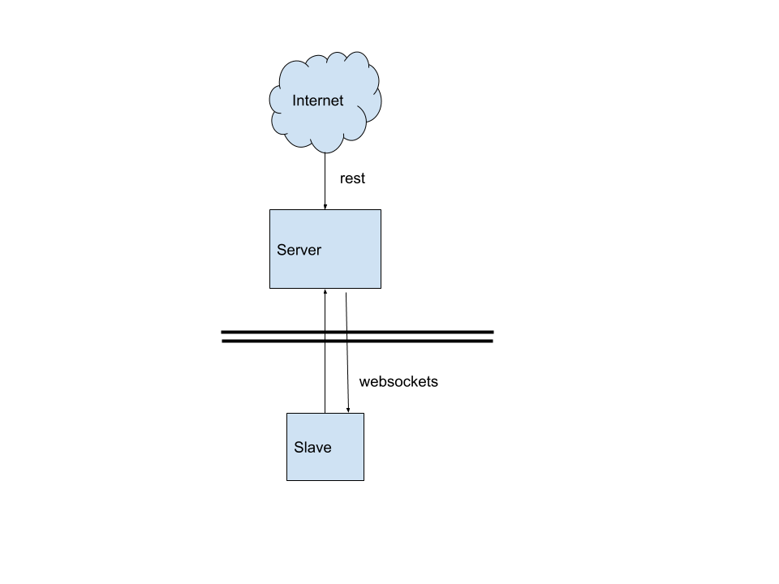

## Websocket slave server 

Because sometimes you want to run something on a server, but you don't have direct acces to it; maybe because it is behind a router you can't manage, or your network is using CG-NAT.

## How it works

Deploy the server/main.js in a server you get access, which is a nodejs server with websockets and a simple html page (to manually trigger actions)

Deploy slave/slave.js on your private network, this nodejs script will connect via websockets to the public server and it will receive notifications from it.

You can have multiple slaves connected to a single server, every notification will be send to all slaves.

The REST endpoint on the server is protected by a token that you can set on server/main.js